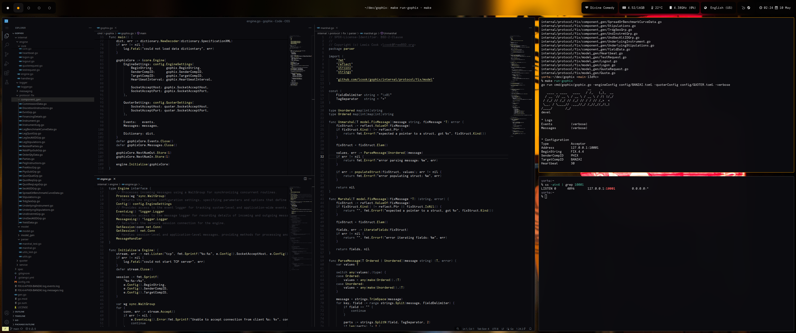
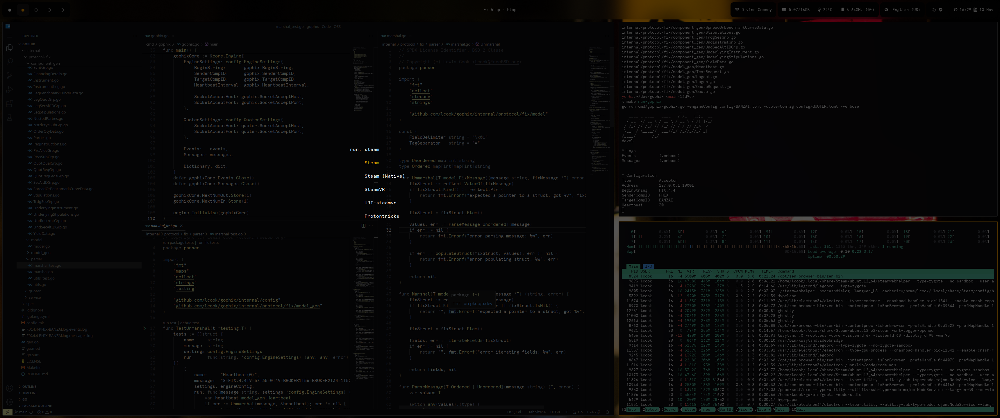

- [About](#about)
    - [Screenshots](#screenshots)
    - [Applications](#applications)
- [Installation](#installation)
    - [Local changes](#local-changes)
- [License](#license)

### About

This repository contains my personal configuration files, which
are shared across both FreeBSD and Linux hosts alike. These
configurations are designed to streamline my workflow and provide
a consistent environment across different systems.

#### Screenshots






#### Applications

* Window manager: [hyprland](https://github.com/hyprwm/hyprland)
* Wallpaper utility: [hyprpaper](https://github.com/hyprwm/hyprpaper)
* Lockscreen utility: [hyprlock](https://github.com/hyprwm/hyprlock/)
* Statusbar: [waybar](https://github.com/Alexays/waybar)
* Application launcher: [tofi](https://github.com/philj56/tofi)
* Notifications: [mako](https://github.com/emersion/mako)
* Shell: [fish](https://github.com/fish-shell/fish-shell)
* Terminal: [ghostty](https://github.com/ghostty-org/ghostty)

### Installation

1. **Clone the repository**: Begin by cloning the repository to your local machine.
                             It is recommended to place it in a directory such as
                             `~/dev` or any other location where you typically store
                            Git repositories. You can do this by running the
                            following command in the terminal:

    ```shell
    git clone https://github.com/lcook/dots
    ```

2. **Run the themer script**: After cloning the repository, you will need to run
                              the `themer` script. This script generates several
                              configuration files based on the theme.conf
                              configuration file. Make sure to specify the desired
                              theme name when executing the script. For example,
                              to use the theme named `pontocho`, run:

    ```shell
    ./0-themer pontocho
    ```

3. **Set up symbolic links**: The final step is to ensure that the symbolic link
                              are setup in `~/.config`. This can be accomplished
                              by executing the following command:

    ```shell
     ./1-symlinks
    ```

Once you have completed these steps, the `~/.config` directory
should contain symbolic links that point to the appropriate
configuration files in the cloned repository. The expected
output should resemble something akin to:

```shell
find ~/.config -type l -printf '%p -> %l\n' | grep dots
/home/lcook/.config/mako -> /home/lcook/dev/dots/mako
/home/lcook/.config/hypr -> /home/lcook/dev/dots/hypr
/home/lcook/.config/tofi -> /home/lcook/dev/dots/tofi
/home/lcook/.config/waybar -> /home/lcook/dev/dots/waybar
/home/lcook/.config/fish -> /home/lcook/dev/dots/fish
/home/lcook/.config/ghostty -> /home/lcook/dev/dots/ghostty
```

#### Local changes

You may notice a script named `9-housekeep` included in
the repository. This script is designed to perform a
`git clean` operation, which effectively removes
untracked files to help maintain less cluster.

As a general rule of thumb, to add local modifications
to configuration files, files that are denoted with a
`.local` suffix are neither tracked by git nor housekept
as part of the cleaning operation.

For instance, in the fish shell configuration file, note
the following:

```shell
set -l local_config ~/.config/fish/conf.d/config.fish.local
test -e $local_config; and source $local_config
```

This approach allows to keep per-machine local configuration
files without affecting or polluting the main files stored
in the repository.

### License

[BSD 2-Clause](LICENSE)

Happy hacking!
